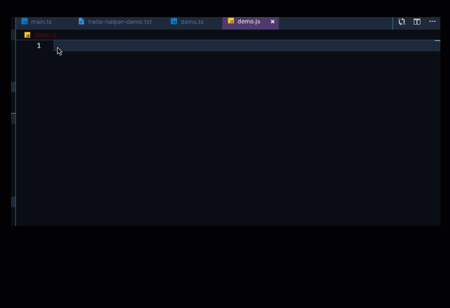

# Trello Helper - Simplifying the Trello API

This project is designed to make using the Trello API easier and it provides several dozen higher level functions to perform common tasks. Most of the functions take a single parameter with object property names that help describe the function. This means you can't get the parameters in the wrong order. If you don't need the options or body properties, you can leave the property off. Declaration files have been created so you should get full code assistance if your editor supports it and full type safety if you use it from TypeScript.

[](~https://www.npmjs.com/package/trello-helper)

[](https://codeclimate.com/github/Rolias/trello-helper/maintainability)
[](https://codeclimate.com/github/Rolias/trello-helper/test_coverage)
[](https://github.com/Rolias/trello-helper)

## Example call to get cards on list with and without option property specified

```javascript
getCardsOnlist({ listId: "123", options: { limit: 10 } });
// or
getCardsOnList({ listId: "123" });
```



Additionally, this package wraps the `get`, `put`, `post`, and `delete` commands to the Trello API to take card of the authorization elements. But, it also exposes many higher-level commands needed for working with boards, lists, cards, actions, and custom fields. The wrappers all use Promises (no callback syntax support), and the code uses `async/await` syntax.

## Table of Contents

- [Installation](#installation)
- [Cheat Sheet](#cheat-sheet)
- [Contributing](#contributing)
- [Testing](#testing)
- [Integration Tests](#integration-tests)
- [Dependencies](#dependencies)
- [Available Functions and Documentation](#available-functions)

---

## Installation

`npm install trello-helper`

---

## Cheat Sheet

```javascript
const { Trello } = require("trello-helper");
const trello = new Trello("/Users/ENV_VARS/trello.env.json");
const demo = async () => {
  // get all the cards on the specified list
  const cardsOnList = await trello.getCardsOnList({
    listId: "5c9a9d8afcf46f3f1fdb6698"
  });
  // get all the actions on card 123 that are of type 'moveToBoard'
  const mtbActions = await trello.getActionsOnCard({
    cardId: "5c9a9d95f770d24919eb7edb",
    options: { filter: "moveToBoard" }
  });
  // get up to 1000 actions on a card
  const actions = await trello.getActionsOnCard({
    cardId: "5c9a9d95f770d24919eb7edb"
  });
  // get all the custom field data for a card
  const cf = await trello.getCustomFieldItemsOnCard({
    cardId: "5c9a9d95f770d24919eb7edb"
  });
  // set the value of a custom field
  await trello.setCustomFieldValueOnCard({
    cardFieldObj: {
      cardId: "5c9a9d95f770d24919eb7edb",
      fieldId: "5c9e45e513d1db64b50fdca2"
    },
    type: "text",
    value: "some data"
  });
};
```

If you pass an empty string to the `Trello` constructor, it will look for your credentials in the root folder of the project in a file named .env.json. If you don't want to store your credentials there, pass the path to where they are. The credentials JSON file needs to have the following form:

```JSON
{
  "trelloHelper": {
    "appKey": "your app key",
    "token": "your token value"
  }
}
```

You can have other items in this file, but `trelloHelper` must be a top-level object in the file with the 'appKey' and 'token' property names. Of course, you must put in a valid app key and token strings for both properties.

---

## Contributing

See the [Contributing](./CONTRIBUTING.md) file.

---

## Dependencies

[winston](https://www.npmjs.com/package/winston) logging tool  
[env-create](https://www.npmjs.com/package/env-create) reads a JSON file and turns top level elements into environment variables  
[moment](https://www.npmjs.com/package/moment) flexible handling of JavaScript dates and times  
[request](https://www.npmjs.com/package/request)
[request-promise-native](https://www.npmjs.com/package/request-promise-native)

---

## Available Functions

See the [GitHub documentation](https://htmlpreview.github.io/?https://raw.githubusercontent.com/Rolias/trello-helper/master/docs/classes/_trello_.trello.html) for the list of available functions and signatures.

---

[back to top](#table-of-contents)
